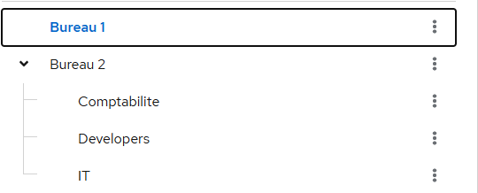
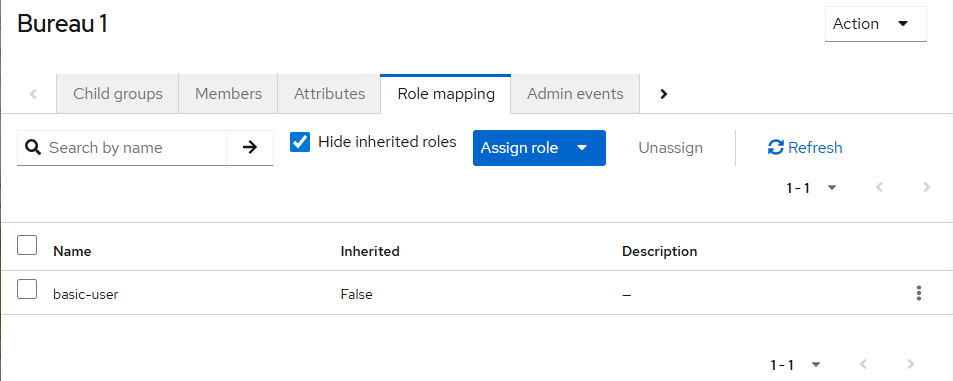
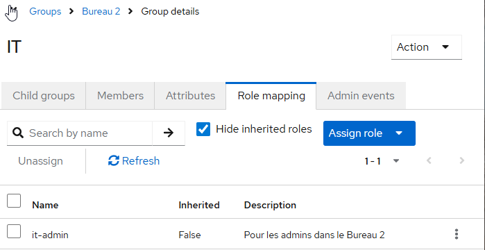
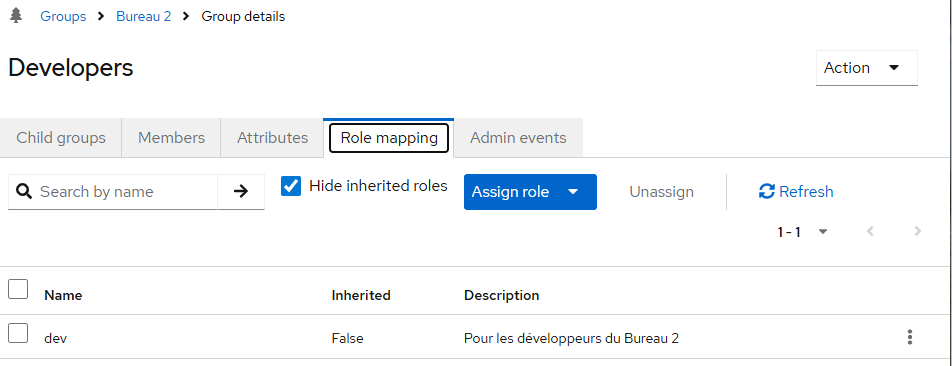
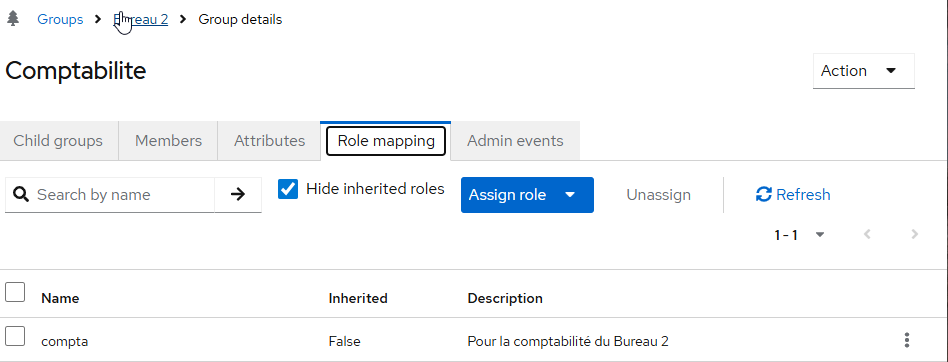
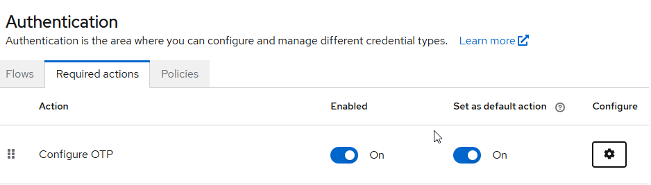
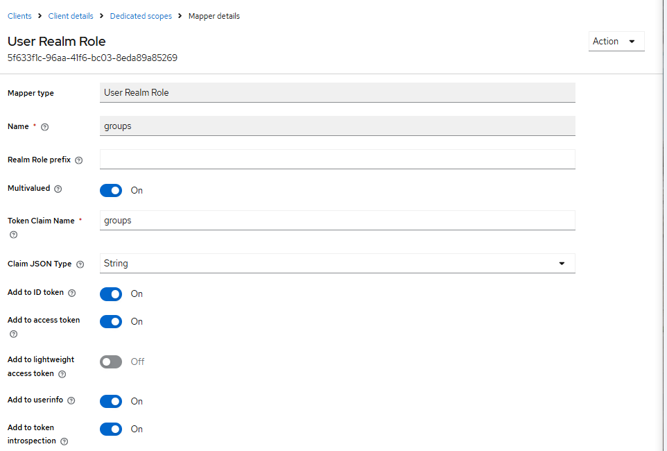
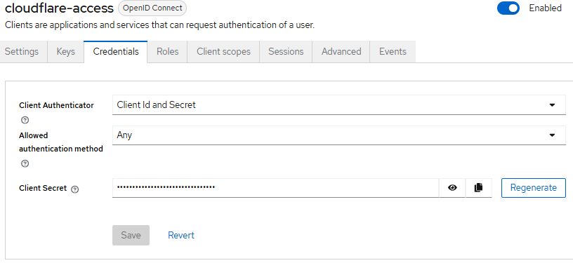

# Phase 1 — Identity Broker & ZTNA

> **Objectif :** Un seul login qui ouvre tous les outils internes. MFA activé. Cloudflare Access protège tout.  
> **IdP :** Keycloak (déjà déployé sur `auth.charif-labs.tech`)

---

## Prérequis Phase 1

- [x] Phase 0 validée (VLAN, DNS, Cloudflare Tunnel actif)
- [x] Keycloak déployé sur `auth.charif-labs.tech`
- [x] Realm `charif-labs` créé dans Keycloak
- [x] Google Cloud Identity tenant validé (`google.charif-labs.tech`)

---

## 1.1 — Finaliser la Configuration Keycloak

### Groupes à créer / vérifier

Keycloak Admin → `charif-labs` realm → Groups :

| Groupe | Utilisateurs | VLAN | Profil cloud |
|---|---|---|---|
| `bureau-1` | Basic users | 20 | Google-Only |
| `bureau-2-it` | Admins IT | 20 | Microsoft-Only |
| `bureau-2-dev` | Développeurs | 20 | Microsoft-Only |
| `bureau-2-compta` | Comptabilité | 20 | Microsoft-Only |

### Rôles associés aux groupes

Keycloak → Realm roles → créer puis assigner via Groups → Role Mappings :

```
basic-user  → bureau-1
```

```
it-admin    → bureau-2-it
```

```
dev         → bureau-2-dev
```

```
compta      → bureau-2-compta
```

### MFA TOTP obligatoire pour les admins

Keycloak → Authentication → Required Actions → Configure OTP → Default Action : ON


- Pour forcer uniquement sur certains groupes :
```
Keycloak → Authentication → Policies → Conditional OTP Policy
  Condition user role : it-admin, dev
  OTP Control User : Force
```

---
## 1.2 — Cloudflare Access sur tous les services

### Créer le Client OIDC Keycloak pour Cloudflare

Keycloak → Clients → Create client

```
Client ID   : cloudflare-access
Client type : OpenID Connect
Name : Cloudflare Access
Valid redirect URIs : https://charif-labs.cloudflareaccess.com/cdn-cgi/access/callback

Client auth : ON (confidential)
```

Onglet **Client scopes** → `cloudflare-access-dedicated` → Add mapper → Groups :

```
Name            : groups
Token Claim Name: groups
Add to ID token : ON
Add to userinfo : ON
```

Copier le `Client Secret` depuis l'onglet **Credentials**.

### Dans Cloudflare Zero Trust Dashboard

Settings → Authentication → Add Provider → OpenID Connect

```
Name         : Keycloak
Client ID    : cloudflare-access
Client Secret: [depuis Keycloak → Clients → cloudflare-access → Credentials]
Auth URL     : https://auth.charif-labs.tech/realms/charif-labs/protocol/openid-connect/auth
Token URL    : https://auth.charif-labs.tech/realms/charif-labs/protocol/openid-connect/token
JWKS URL     : https://auth.charif-labs.tech/realms/charif-labs/protocol/openid-connect/certs
```
### Policies Access par service

| Service        | Domaine                    | Groupe requis |
| -------------- | -------------------------- | ------------- |
| Keycloak Admin | auth.charif-labs.tech      | bureau-2-it   |
| Wazuh          | wazuh.charif-labs.tech     | bureau-2-it   |
| n8n            | n8n.charif-labs.tech       | bureau-2-it   |
| Portainer      | portainer.charif-labs.tech | bureau-2-it   |

---
## 1.3 — Portainer
### Déployer Portainer
```yaml
# docker/portainer/docker-compose.yml
services:
  portainer:
    image: portainer/portainer-ce:latest
    volumes:
      - /var/run/docker.sock:/var/run/docker.sock
      - portainer_data:/data
    networks:
      - sovereign_net
    restart: unless-stopped
volumes:
  portainer_data:
networks:
  sovereign_net:
    external: true
```
### Client Keycloak pour Portainer
Keycloak → Clients → Create client

```
Client ID  : portainer-sso
Client type: OpenID Connect
Client auth: ON
Valid redirect URIs: https://portainer.charif-labs.tech/*
```
### Configurer OIDC dans Portainer
Portainer → Settings → Authentication → OAuth
```
Client ID       : portainer-sso
Client Secret   : [Keycloak → Clients → portainer-sso → Credentials]
Authorization URL: https://auth.charif-labs.tech/realms/charif-labs/protocol/openid-connect/auth
Access Token URL : https://auth.charif-labs.tech/realms/charif-labs/protocol/openid-connect/token
Resource URL     : https://auth.charif-labs.tech/realms/charif-labs/protocol/openid-connect/userinfo
Redirect URL     : https://portainer.charif-labs.tech/
Logout URL       : https://auth.charif-labs.tech/realms/charif-labs/protocol/openid-connect/logout
Scopes           : openid email profile groups
```

### Cloudflare Tunnel → Portainer

```hcl
# ingress.tf
ingress_rule {
  hostname = "portainer.charif-labs.tech"
  service  = "http://portainer:9000"
}
```

```bash
terraform apply
curl -I https://portainer.charif-labs.tech
# Attendu : 302 → Cloudflare Access
```

---

## 1.4 — Identity Provider Microsoft (bouton "Se connecter avec Microsoft")

> Permet aux utilisateurs Bureau-2 de se connecter à Keycloak avec leur compte `@ms.charif-labs.tech`.

### App Registration Entra ID

1. Entra Admin → App Registrations → New Registration
2. Nom : `keycloak-idp-microsoft`
3. Redirect URI (Web) : `https://auth.charif-labs.tech/realms/charif-labs/broker/microsoft/endpoint`
4. Copier Application (client) ID + générer Client Secret

### Identity Provider dans Keycloak

Keycloak → `charif-labs` realm → Identity Providers → Add provider → Microsoft

```
Alias        : microsoft
Display Name : Se connecter avec Microsoft
Client ID    : [Application ID Entra]
Client Secret: [Secret Value Entra]
```

**Test :** Bouton "Se connecter avec Microsoft" visible sur `auth.charif-labs.tech` → login `user-admin-01@ms.charif-labs.tech` → session Keycloak active ✅

---

## 1.5 — Identity Provider Google (bouton "Se connecter avec Google")

1. Google Cloud Console → APIs & Credentials → OAuth 2.0 Client IDs → Create
   - Type : Web application
   - Redirect URI : `https://auth.charif-labs.tech/realms/charif-labs/broker/google/endpoint`
2. Copier Client ID + Secret

Keycloak → Identity Providers → Add provider → Google

```
Alias        : google
Display Name : Se connecter avec Google
Client ID    : [depuis Google Cloud Console]
Client Secret: [depuis Google Cloud Console]
```

---

## Endpoints Keycloak de Référence

```
Discovery : https://auth.charif-labs.tech/realms/charif-labs/.well-known/openid-configuration
Auth      : https://auth.charif-labs.tech/realms/charif-labs/protocol/openid-connect/auth
Token     : https://auth.charif-labs.tech/realms/charif-labs/protocol/openid-connect/token
JWKS      : https://auth.charif-labs.tech/realms/charif-labs/protocol/openid-connect/certs
Userinfo  : https://auth.charif-labs.tech/realms/charif-labs/protocol/openid-connect/userinfo
Logout    : https://auth.charif-labs.tech/realms/charif-labs/protocol/openid-connect/logout
Admin UI  : https://auth.charif-labs.tech/admin/charif-labs/console/
```

---

## Validation Gatekeeper Phase 1

```bash
# Discovery endpoint opérationnel
curl -s https://auth.charif-labs.tech/realms/charif-labs/.well-known/openid-configuration | jq .issuer

# Portainer redirige vers Cloudflare Access
curl -I https://portainer.charif-labs.tech

# Logs Keycloak — connexions
docker compose logs keycloak-1 | grep "type=LOGIN"
```

| Test                           | Attendu                        | ✅/❌ |
| ------------------------------ | ------------------------------ | --- |
| Portainer sans auth            | 302 → Cloudflare Access        |     |
| Login user-admin-01            | MFA TOTP demandé               |     |
| Login user-basic-01            | Pas de MFA                     |     |
| Accès Wazuh avec user-basic-01 | Refusé par Cloudflare Access   |     |
| Discovery endpoint             | Répond 200 avec issuer correct |     |
