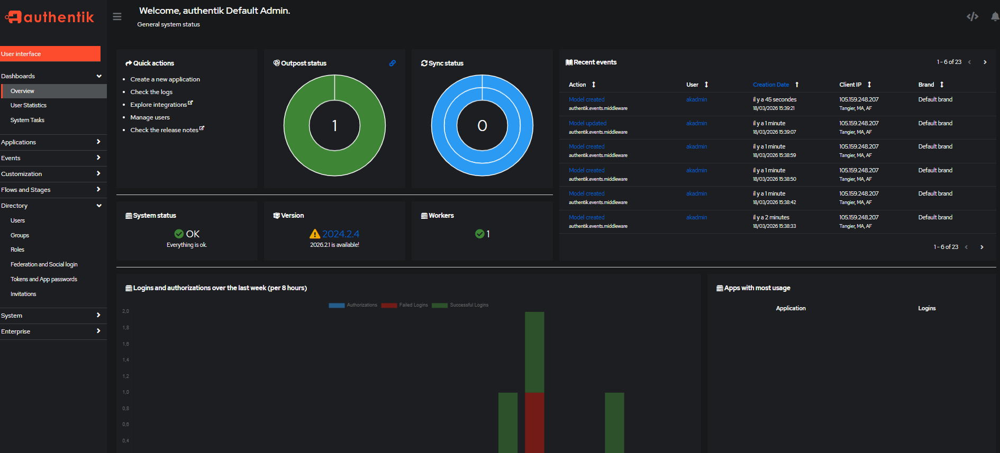
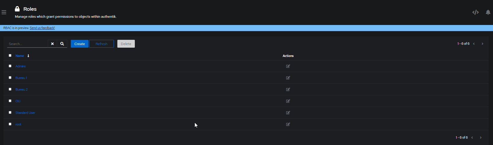

- Configuration de compte Admin initial : `akadmin`
### authentik 

Access Admin Interface

- Create Roles  : 

| Nom       | Parent    | Rôle                  |
| --------- | --------- | --------------------- |
| `Bureau1` | _(aucun)_ | OU racine Bureau 1    |
| `Basique` | `Bureau1` | Utilisateurs standard |
| `Bureau2` | _(aucun)_ | OU racine Bureau 2    |
| `Admins`  | `Bureau2` | Administrateurs       |

- Create Groups :

