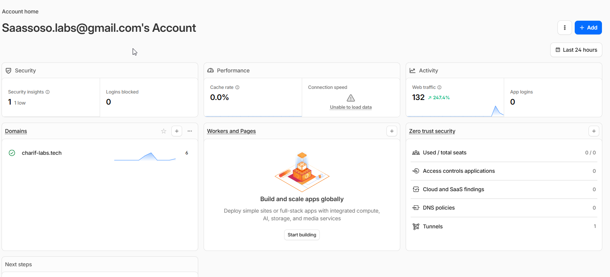
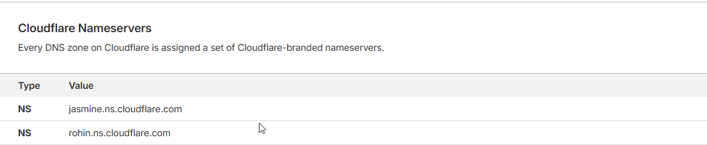
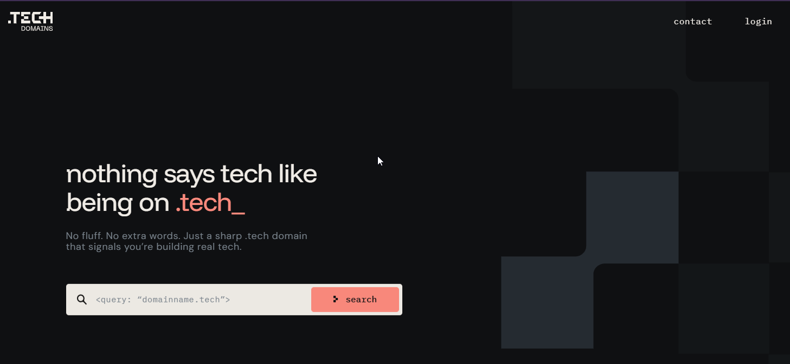
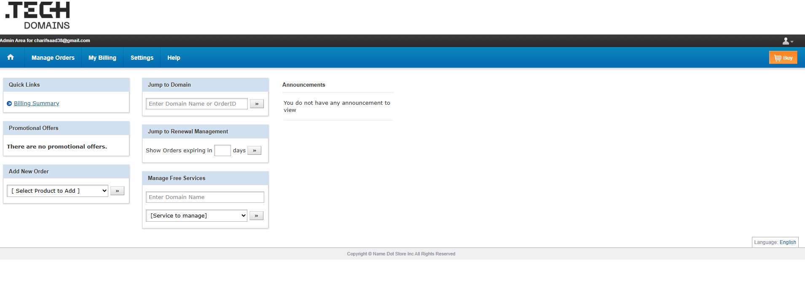
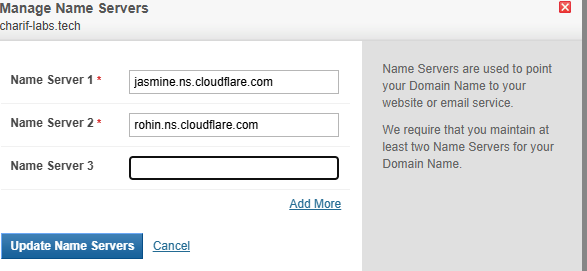
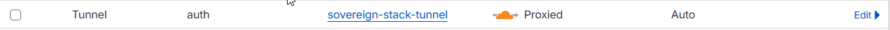
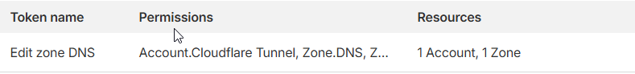

### Délégation DNS
- `charif-labs.tech` : (`nslookup -type=ns charif-labs.tech`)
#### Déclaration de la Zone (Plan de Contrôle Cloudflare) :
Crée ton compte Cloudflare et ajoute le domaine `charif-labs.tech`. 

Le système va analyser tes enregistrements DNS existants et te fournir une paire de serveurs de noms (NS) uniques à ton tenant.

#### Opération de Sécurité (Registrar Actuel)
Dans l'interface de registrar `Tech Domains` .

- Le Dashboard :

Désactive DNSSEC : 
- Pour éviter de casser la résolution durant le transfert. 
Si tu modifies les NS alors que DNSSEC est actif avec les anciennes clés, ton domaine sera cryptographiquement rejeté par les résolveurs mondiaux.
- **le Registre, ex: .fr ou .com :** Détient une empreinte (enregistrement DS) de ta clé publique.
- **Le DNS :** Détient la clé privée qui signe les enregistrements.
#### Modification des Enregistrements d'Autorité 
Remplace les serveurs de noms existants par les deux serveurs fournis par ton tenant Cloudflare.

### Creation du tuneel
- Connecte-toi à ton tableau de bord Cloudflare.
- Dans le menu de gauche, clique sur **Zero Trust** 
	-  **Networks** et clique sur **Tunnels**.
     **Add a tunnel** (ou Create a tunnel).
- Sélectionne le type de connecteur : **Cloudflared** et clique sur _Next_.
- Nom : sovereign-stack-tunnel

### Création du Token API
Généré le Token API Cloudflare avec les permissions minimales (Zone:DNS:Edit, Zone:Zone:Read) pour l'utilise dans [[Terraform]].

### 

### 

### 

