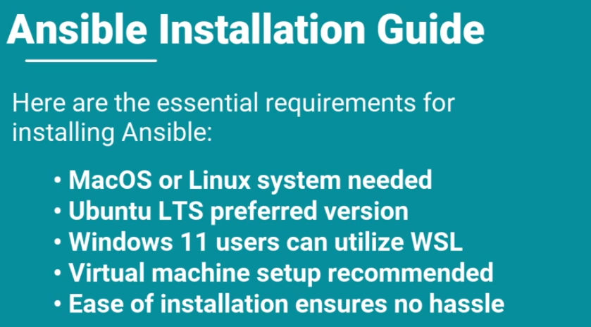

---

tags: [outil, iac, configuration-management]

concepts: [IaC]

---
## Rôle dans ce projet

Configure tout ce qui existe déjà (là où [[../../Terraform]] crée) :
- Hardening CIS Windows 11 (équivalent GPO sans Active Directory)
- Déploiement agents Wazuh et Sysmon
- Configuration WireGuard sur les endpoints
- Politiques de sécurité Windows (password policy, audit, BitLocker)

## Agentless via WinRM

Ansible n'installe pas d'agent. Il se connecte via **WinRM HTTPS** (port 5986) sur Windows.

```ini
# ansible/inventory.ini
[windows]
lab-basic-01  ansible_host=10.0.20.101
lab-admin-01  ansible_host=10.0.20.102

[windows:vars]
ansible_user=ansible-svc
ansible_password={{ vault_winrm_password }}
ansible_connection=winrm
ansible_winrm_transport=ssl
ansible_winrm_port=5986
ansible_winrm_server_cert_validation=ignore
```

## Ansible Vault

Les mots de passe WinRM sont chiffrés (AES-256) dans Ansible Vault.

```bash
# Chiffrer une valeur
ansible-vault encrypt_string 'monmotdepasse' --name 'vault_winrm_password'

# Lancer un playbook avec le vault
echo $VAULT_PASS | ansible-playbook --vault-password-file /dev/stdin playbook.yml
```

> **Règle critique** : Le mot de passe vault ne doit JAMAIS être dans un fichier sur disque. Toujours injecter via variable d'environnement `VAULT_PASS`.

## Modules Windows clés

| Module | Usage |
|---|---|
| `win_ping` | Tester la connectivité (équivalent ping) |
| `win_regedit` | Modifier le registre (équivalent GPO Registry) |
| `win_security_policy` | Password policy, account lockout |
| `win_feature` | Activer/désactiver des fonctionnalités Windows |
| `win_bitlocker` | Activer BitLocker + escrow clé |
| `win_package` | Installer des packages (.msi, .exe) |
| `win_service` | Gérer les services Windows |

## Rôles du projet

```
ansible/
├── inventory.ini
├── group_vars/
│   └── windows.yml          # Variables + vault
└── playbooks/
    ├── roles/
    │   ├── cis-hardening/   # Contrôles CIS L1 Windows 11
    │   ├── wazuh-agent/     # Déploiement + enrôlement agent
    │   ├── sysmon-deploy/   # Sysmon + config sysmon-modular
    │   └── bitlocker/       # BitLocker + escrow Entra
    └── site.yml             # Playbook principal
```

## Test de connectivité

```bash
ansible windows -m win_ping
# Résultat attendu : {"ping": "pong"}
```

# Ansible 
- Automation tools ( conf/ deploy / system )
	- Infra as code : Playbooks 
	- Agentless architecture : SSH/WinRM
		- YAML : easy to read
		- chef or puppet have their own env 
	- Challenges during automation : no every operation may succeed on the first try 
		- **declarative** : clear outcomes based on existing cdts
			- error handling and state recognitions
		- **Imperative** : step by step , flow with order of succeful operation 
			- group and user maagment 


_Jinja2_ templating to incorporate varibales to our output msg by evaluating threm 

### Ansible Galaxy 
Community-contributed roles and collections 
- Roles / Community / Tools / Time 
## Install Ansible :
#### Perquisites 

``` python
pip --version
pip install ansible 
```

#### Installation 

```

sudo apt update


 upgrade ansible 
 
  pip intstall ansible --upgrade
  
  uninstall ansible 
  install ansible@2.0
  
  
  
```
